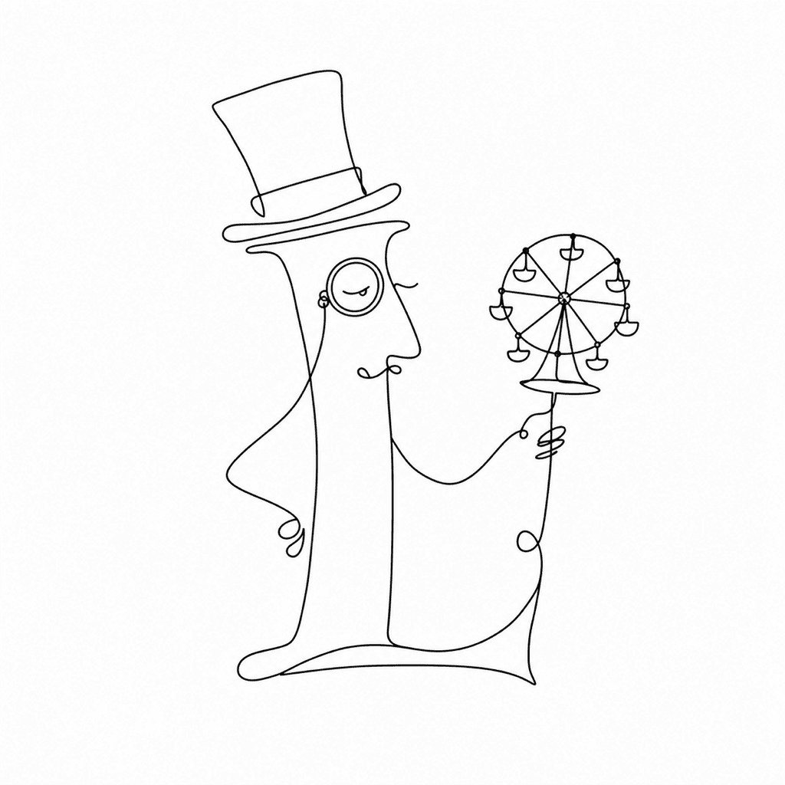

# Fairplay

Fairplay is a fork of [Playfair Display](https://github.com/clauseggers/Playfair-Display), the high-contrast transitional serif by Claus Eggers Sørensen. It keeps Playfair's ball terminals and hairline serifs, then narrows the shapes into a semi-condensed display cut and ships them as two variable fonts you can drop straight into a layout.

## What Fairplay adds

- **Two variable fonts**, upright and italic, in `fonts/ttf-variable/`.
- **Three axes** on every font:
  - `opsz` (optical size) from 7 to 256 — hairlines thicken as the type shrinks, so captions stay legible and headlines stay sharp.
  - `wght` (weight) from 400 to 900 — Regular through Black.
  - `wdth` (width) from 85 to 110 — the semi-condensed default at 85 opens out toward the original proportions at 110.
- **Latin and Cyrillic** coverage — roughly 1,150 glyphs per font, with reworked Cyrillic letterforms.

The family name in the fonts is *Fairplay SemCond Display*: semi-condensed, built for display sizes.

## Install

Download a `.ttf` from `fonts/ttf-variable/` and install it like any other font. Both files are OpenType variable fonts, so one file per style covers the full weight, width, and optical-size range in any application that reads variation axes.

## Sources

FontLab sources live in `sources/` as `.vfj` (Fairplay-Roman, Fairplay-Italic). Open them in [FontLab 8](https://www.fontlab.com/) to edit the masters and re-export. The `Test documents/` folder holds InDesign and PDF proofs — character sets, glyph comparisons, OpenType feature tests, and multilingual specimens.

## License

Fairplay is released under the [SIL Open Font License 1.1](OFL.txt), the same license as Playfair Display. You can use, study, modify, and redistribute the fonts, including bundling them with your own work.

## Credits

Playfair Display by Claus Eggers Sørensen. Fairplay fork and Cyrillic work by Adam Twardoch.
